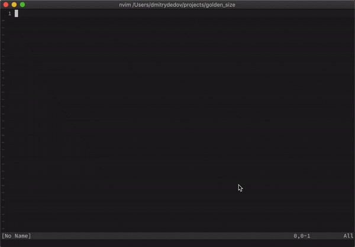

# Golden Size

This is a Neovim plugin for automatically resizing the active window to the ["golden"](https://en.wikipedia.org/wiki/Golden_ratio) size.



## Installation

Add plugin to the runtime path.

### Vim-Plug 

```VimL
Plug 'dm1try/golden_size'

```

## Disable automatic resizing for specific windows

```viml
lua << EOF
local function ignore_nerdtree()
  local filetype = vim.api.nvim_buf_get_option(0, 'filetype')
  if filetype == 'nerdtree' then
    return 1
  end
end

local function ignore_terminal()
  local buftype = vim.api.nvim_buf_get_option(0, 'buftype')
  print(buftype)
  if buftype == 'terminal' then
    return 1
  end
end

local golden_size = require("golden_size")
-- set the callbacks, preserve the defaults
golden_size.set_ignore_callbacks({
  ignore_nerdtree,
  ignore_terminal,
  golden_size.ignore_float_windows, -- default one, ignore float windows
  golden_size.ignore_by_window_flag, -- default one, ignore windows with w:ignore_gold_size=1
  })
EOF
``` 
## Inspiration

https://github.com/roman/golden-ratio
